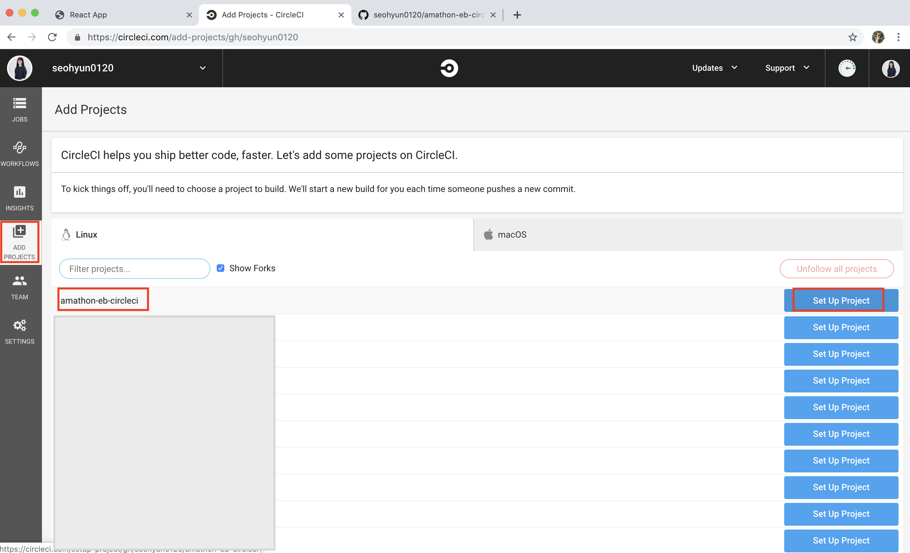
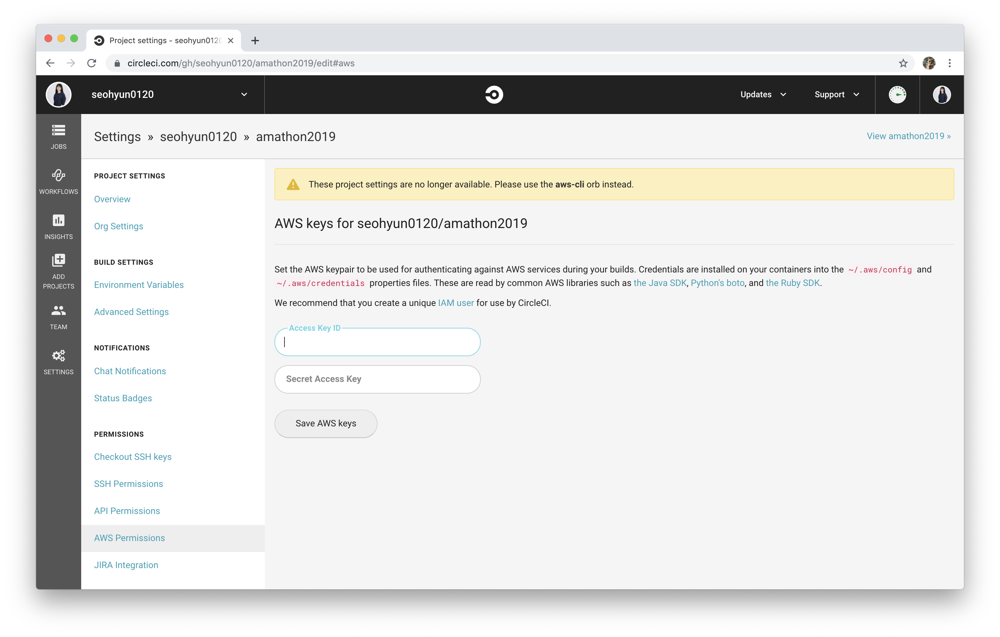

# CircleCI

CircleCI 로그인 후, 상단에 'Go to app'을 클릭해주세요.


다음과 같은 화면을 볼 수 있습니다. 우리의 프로젝트에도 circleci를 세팅해보도록 합시다. 


**1)** 해당하는 레포에 **'Set Up Project'** 버튼을 클릭해주세요.




**2)** root 디렉토리에 `.circleci` 폴더를 생성해주세요.

**3)** 생성된 폴더 안에 `config.yml` 파일을 생성해주세요.

다음과 같이 코드를 작성해주세요.

**.circleci/config.yml**

```yaml
version: 2
jobs:
  build:
    docker:
      - image: circleci/node:8.10

    working_directory: ~/amathon

    steps:
      - checkout

      - restore_cache:
          name: Restore Yarn Package Cache
          keys:
            - yarn-packages-{{ checksum "yarn.lock" }}

      - run:
          name: Install Dependencies
          command: yarn install --frozen-lockfile

      - save_cache:
          name: Save Yarn Package Cache
          key: yarn-packages-{{ checksum "yarn.lock" }}
          paths:
            - ~/.cache/yarn


```


### Jobs

circleci는 1개 이상의 job을 수행합니다. 수행할 작업은 모두 `jobs`에서 정의되어야합니다. 

- **docker**

  circleci 2.X 버전의 장점은 `docker`를 natvie로 지원하는 점입니다. 우리의 프로젝트는 node 8.10 버전에서 실행중이므로, 다음과 같이 작성해주세요. 혹시나 8.10가 아닌 다른 버전을 사용중일 경우, [여기](https://hub.docker.com/u/circleci) 에서 본인이 해당하는 버전을 찾아 작성해주세요.


- **working_directory**

  현재 디렉토리의 경로를 입력해주세요. 저는 'amathon' 이라는 폴더 아래에서 진행중입니다!


- **steps**

  앞서 우리가 docker image로 사용한 **circleci/node:8.10**에는 **Yarn**이 미리 설치되어있기에 **Yarn** 설치과정은 생략해도 됩니다.

  매번 commit 할 때마다 패키지들을 설치하면 매우 비효율적이겠죠? build 시간을 단축시키기 위해 패키지들을 캐싱하도록 합시다. 

  

  Yarn 패키지 캐시 복원 ➡️ Dependecies 설치 ➡️ Yarn 패키지 캐시 저장


4) 지금까지의 변경사항을 **commit** 한 후 **push** 해주세요.

5) **Start Building** 버튼을 눌러주세요.

다음과 같이 **'SUCCESS'** 가 뜬 것을 확인할 수 있습니다. 

