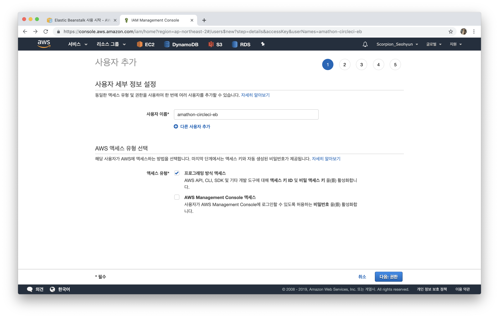
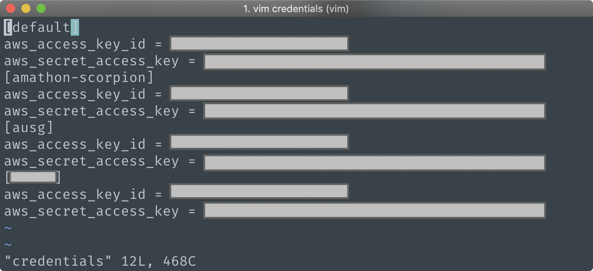
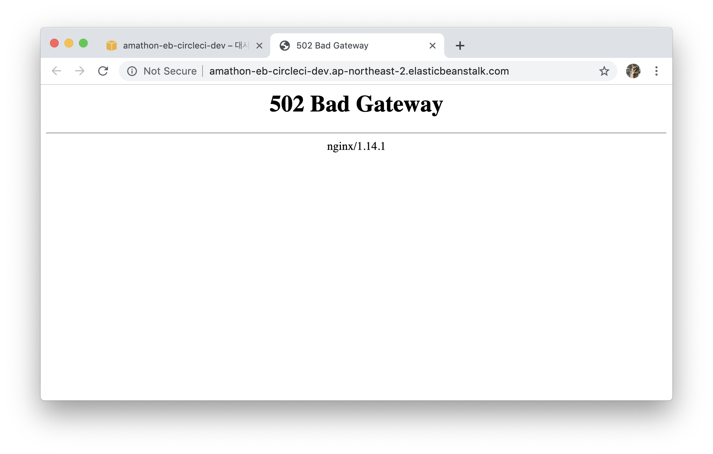
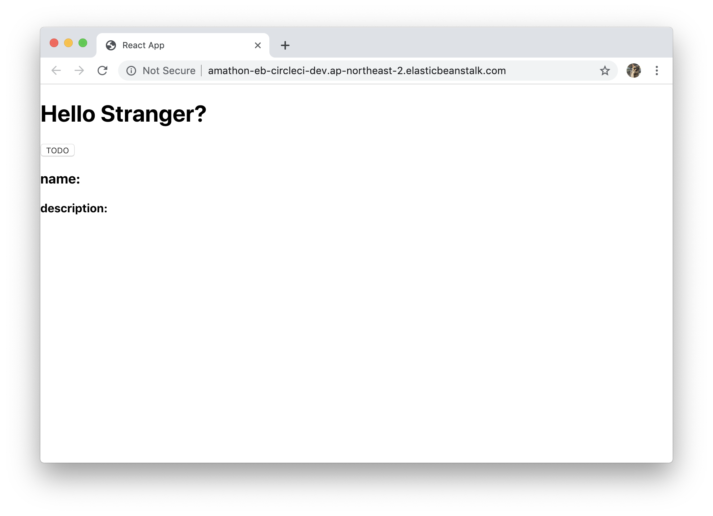

# ElasticBeanstalk

AWS ElasticBeanstalk에 이때까지 만든 애플리케이션을 배포해보도록합시다. 


## 0️⃣ IAM 사용자 생성하기

AWS Console에 로그인 후, 서비스에서 **IAM**을 클릭하면 다음과 같은 화면을 볼 수 있습니다. 


`사용자 추가`를 클릭해주세요.



`사용자 이름`: amathon-circleci-eb 

`AWS 엑세스 유형`: 프로그래밍 방식 엑세스 선택 후 **다음**을 눌러주세요.


`기존 정책 직접 연결` 을 선택한 후, 검색창에 `elasticbeanstalk` 이라고 검색해주세요. 그 중, **AWSElasticBeanstalkFullAccess** 이라고 적힌 full access를 부여하도록 합시다. 그 후 **다음**을 눌러주세요. 

`태그 추가`는 넘기고, 다시 한번 제대로 설정했는지 검토한 후, `사용자 만들기` 버튼을 눌러주세요.


다음과 같이 사용자가 생성된 것을 확인할 수 있습니다. 


## 🆒 AWS Configure 구성하기

방금 생성한 사용자를 AWS CLI에서 사용할 수 있도록 설정해봅시다. 터미널을 열어 아래와 같이 작성해봅시다.

profile  속성을 통해 여러 계정을 switching하며 사용할 수 있도록 설정해봅시다.

```shell
$ aws configure --profile amathon
AWS Access Key ID [None]: 방금 생성된 엑세스 키 ID
AWS Secret Access Key [None]: 방금 생성된 비밀 엑세스 키
Default region name [None]: ap-northeast-2
Default output format [None]: json
```

<br>

**AWS CLI**는 `aws configure`를 사용하여 지정하는 자격 증명을 홈 디렉터리의 `.aws`라는 폴더에 있는 `credentials`라는 로컬 파일에 저장합니다. OS에 따라 저장위치가 다르니 아래를 확인해주세요.

**macOS, Linux, Unix**

```~/.aws/credentials
~/.aws/credentials
```

**Windows**

```
C:\Users\USERNAME\.aws\credentials
```

<br>

```shell
$ cd .aws
$ vim credentials
```

저처럼 **한 개 이상의 사용자**를 등록해둔 경우, 아래와 같이 확인할 수 있습니다.




## 1️⃣ EB CLI 구성하기

`eb init` 을 통해 elastic beanstalk 프로젝트를 시작해봅시다.


1. **Select a default region**

   우리는 ap-northeast-2(Seoul) 리전을 사용해야하므로, `10`을 입력해주세요.

2. **Enter Application Name**

   현재 디렉토리의 이름이 기본값입니다. `amathon-eb-circleci` 라고 입력해주세요.

3. **CodeCommit?**

   우리는 사용하지 않으므로 `N` 라고 입력해주세요.

4. **SSH Keypair**

   EB 인스턴스에 SSH key pair를 할당하기위해 `Y` 를 입력해주세요.

   `3` 을 입력한 후 `amathon-eb` 이름으로 하나 생성해주세요. 

   (저는 이미 해당 key pair가 있어서 그것을 선택하였습니다.)


위와 같이 설정하게되면, 현재 디렉토리에서 `.elasticbeanstalk` 폴더안에 `config.yml` 파일이 생성된 것을 확인할 수 있습니다 저와 똑같이 설정하셨다면, **config.yml** 파일은 다음과 같아야합니다.

**.elasticbeanstalk/config.yml**

```yml
branch-defaults:
  master:
    environment: null
    group_suffix: null
global:
  application_name: amathon-eb-circleci
  branch: null
  default_ec2_keyname: amathon-eb
  default_platform: Node.js
  default_region: ap-northeast-2
  include_git_submodules: true
  instance_profile: null
  platform_name: null
  platform_version: null
  profile: null
  repository: null
  sc: git
  workspace_type: Application
```


ElasticBeanstalk은 **nodejs**로 실행되는데 우리의 server는 ES6으로 실행됩니다. 따라서, 우리의 server code를 순수 nodejs 파일로 변경해줘야합니다.


**package.json**

```
{
  ...,
  "scripts": {
    ...,
    "build": "babel server.js --out-file server.compiled.js"
  }
}
```


빌드를 해봅시다. `server.compiled.js`라는 파일이 생성된 것을 확인할 수 있습니다. 

EB는 우리의 nodejs app을 `server.js`  혹은 `app.js`를 사용합니다. 하지만 우리의 컴파일 파일은 `server.compiled.js` 이기 때문에 수정을 해야합니다. 


**.ebextensions/nodecommand.config**

```config
option_settings:
  aws:elasticbeanstalk:container:nodejs:
    NodeCommand: "node server.compiled.js"
```

이제 EB는 **server.compiled.js** 로 서버를 실행할 수 있습니다. 


## 2️⃣ EB Create

EB 환경을 생성해봅시다. 

```shell
$ eb create
```


몇 분 정도 기다리면 EB 환경이 생성됩니다!


```shell
$ eb status
```


elastic beanstalk 콘솔에서 배포된 웹사이트를 열어봅시다.




URL을 클릭해보면, **'502 Bad Gateway'**가 뜨는 것을 확인할 수 있습니다. 여기까지 오셨다면 정상적으로 배포를 완료하셨습니다. 


## 3️⃣ Proxy 설정

EB에서 Node.js 플랫폼은 역방향 프록시를 사용하여 인스턴스에서 포트 80의 요청을 포트 8081에서 수신 중인 애플리케이션으로 전달합니다. 우리의 서버는 `4001` 번 포트에서 실행되기때문에 **'502 Bad Gateway'**가 뜨는 것을 확인할 수 있습니다. 


따라서 proxy 설정을 해보도록 합시다.

```
$ touch .ebextensions/proxy.config
```


**.ebextensions/proxy.config**

[여기](https://docs.aws.amazon.com/ko_kr/elasticbeanstalk/latest/dg/nodejs-platform-proxy.html?source=post_page)에 적힌 코드를 복사해주시고, 포트 번호만 **'5000'**에서 **'4001'**로 바꿔주세요.

```config
upstream nodejs {
  server 127.0.0.1:4001;
  keepalive 256;
}
```


## 4️⃣ Static File 설정

위에서 작성한 파일을 읽다보면 다음과 같은 코드를 볼 수 있습니다. 

```
location /static {
	alias /var/app/current/static;
}
```

우리가 nodejs 앱을 EB에 배포할 때, 모든 파일이  `/var/app/current`  디렉토리 아래에 저장됩니다. 하지만 우리의 `static` 파일은 root directory 밑이 아닌 `client/build` 아래에 위치하고있습니다.


따라서, 코드를 다음과 같이 수정해주세요

**.ebextensions/proxy.config**

```
location /static {
	alias /var/app/current/client/buildstatic;
}
```


이제까지 수정한 사항들을 git에 올려봅시다. `eb deploy` 명령어는 **가장 최근에 git commit된 코드를 기준**으로 압축파일을 생성해 배포합니다. 배포 전에 **커밋**을 잊지 마세요.


다시 배포를 해봅시다. 

```shell
$ eb deploy
$ eb open
```



로컬에서 작업한 환경 그대로 배포된 것을 확인할 수 있습니다. 