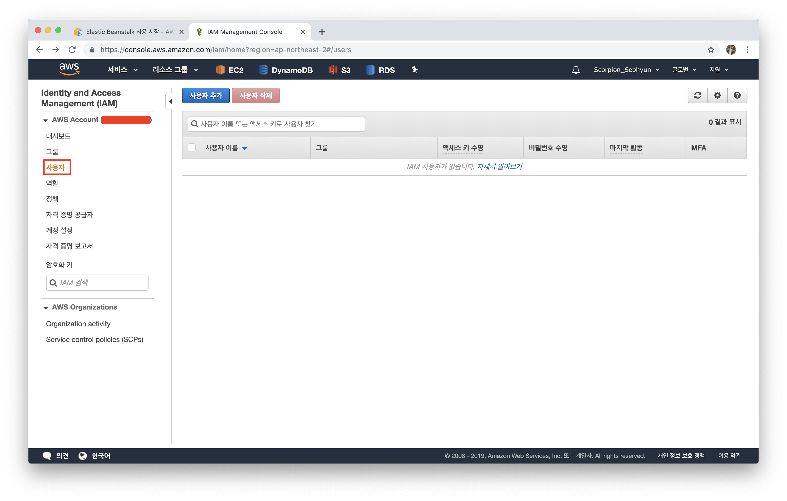
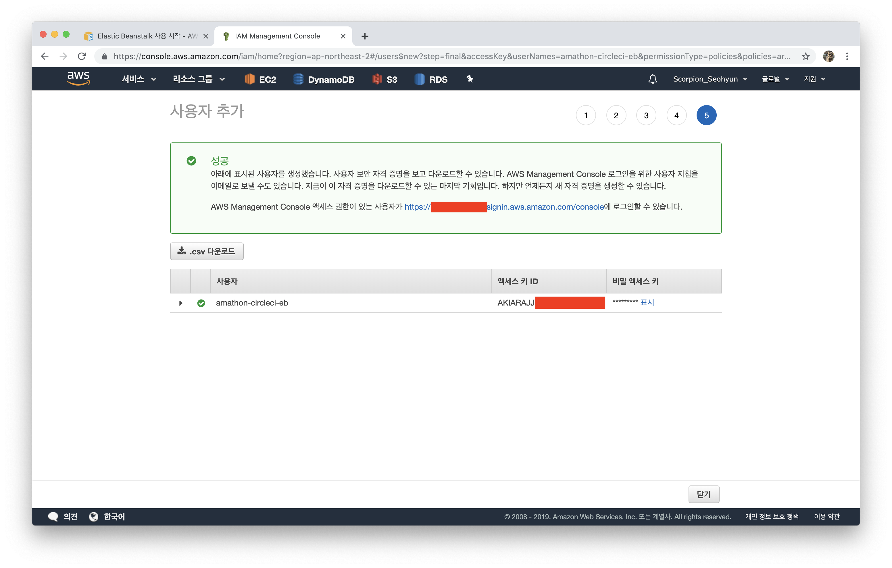
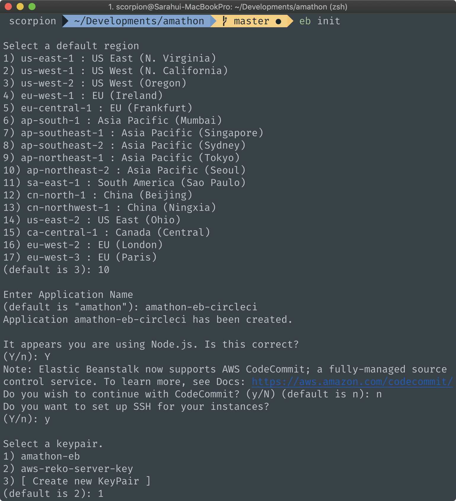

# ElasticBeanstalk

AWS ElasticBeanstalk에 이때까지 만든 애플리케이션을 배포해보도록합시다. 


## 1. IAM 사용자 생성하기

AWS Console에 로그인 후, 서비스에서 **IAM**을 클릭하면 다음과 같은 화면을 볼 수 있습니다. 



`사용자 추가`를 클릭해주세요.


`사용자 이름`: amathon-circleci-eb 

`AWS 엑세스 유형`: 프로그래밍 방식 엑세스 선택 후 **다음**을 눌러주세요.


`기존 정책 직접 연결` 을 선택한 후, 검색창에 `elasticbeanstalk` 이라고 검색해주세요. 그 중, **AWSElasticBeanstalkFullAccess** 이라고 적힌 full access를 부여하도록 합시다. 그 후 **다음**을 눌러주세요. 

`태그 추가`는 넘기고, 다시 한번 제대로 설정했는지 검토한 후, `사용자 만들기` 버튼을 눌러주세요.



다음과 같이 사용자가 생성된 것을 확인할 수 있습니다. 

// aws configure 등록하기


## 2. EB CLI 구성하기

`eb init` 을 통해 elastic beanstalk 프로젝트를 시작해봅시다.



1. **Select a default region**

   우리는 ap-northeast-2(Seoul) 리전을 사용해야하므로, `10`을 입력해주세요.

2. **Enter Application Name**

   현재 디렉토리의 이름이 기본값입니다. `amathon-eb-circleci` 라고 입력해주세요.

3. **CodeCommit?**

   우리는 사용하지 않으므로 `N` 라고 입력해주세요.

4. **SSH Keypair**

   EB 인스턴스에 SSH key pair를 할당하기위해 `Y` 를 입력해주세요.

   `3` 을 입력한 후 `amathon-eb` 이름으로 하나 생성해주세요. 

   (저는 이미 해당 key pair가 있어서 그것을 선택하였습니다.)


위와 같이 설정하게되면, 현재 디렉토리에서 `.elasticbeanstalk` 폴더안에 `config.yml` 파일이 생성된 것을 확인할 수 있습니다 저와 똑같이 설정하셨다면, **config.yml** 파일은 다음과 같아야합니다.

**.elasticbeanstalk/config.yml**

```yml
branch-defaults:
  master:
    environment: null
    group_suffix: null
global:
  application_name: amathon-eb-circleci
  branch: null
  default_ec2_keyname: amathon-eb
  default_platform: Node.js
  default_region: ap-northeast-2
  include_git_submodules: true
  instance_profile: null
  platform_name: null
  platform_version: null
  profile: null
  repository: null
  sc: git
  workspace_type: Application
```


ElasticBeanstalk은 **nodejs**로 실행되는데 우리의 server는 ES6으로 실행됩니다. 따라서, 우리의 server code를 순수 nodejs 파일로 변경해줘야합니다.


**package.json**

```
{
  ...,
  "scripts": {
    ...,
    "build": "babel server.js --out-file server.compiled.js"
  }
}
```


빌드를 해봅시다. `server.compiled.js`라는 파일이 생성된 것을 확인할 수 있습니다. 

EB는 우리의 nodejs app을 `server.js`  혹은 `app.js`를 사용합니다. 하지만 우리의 컴파일 파일은 `server.compiled.js` 이기 때문에 수정을 해야합니다. 


**.ebextensions/nodecommand.config**

```config
option_settings:
  aws:elasticbeanstalk:container:nodejs:
    NodeCommand: "node server.compiled.js"
```

이제 EB는 **server.compiled.js** 로 서버를 실행할 수 있습니다. 


AWS ElasticBeanstalk에서 NodeJS 애플리케이션은 8081번 포트로 실행됩니다. 하지만 우리의 서버는 4001번에서 실행됩니다. 