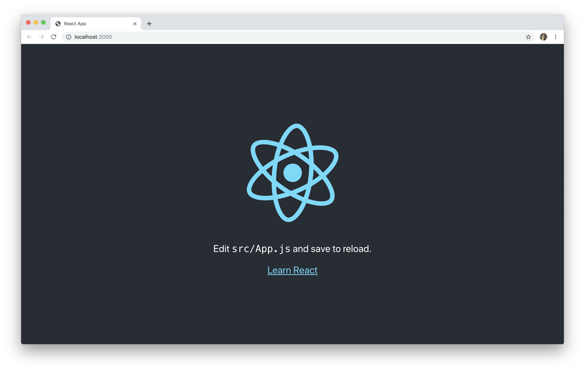
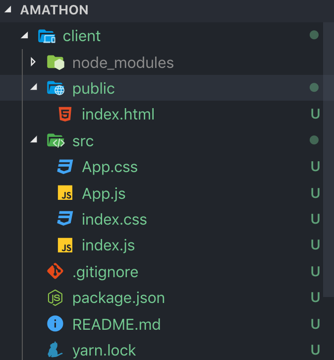
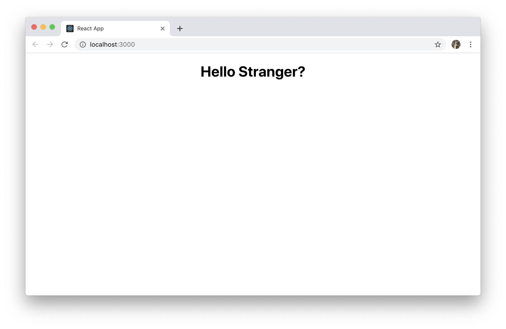

## React + Express

이번 세션에서는 Front-End와 Back-end를 하나의 레포에 두고 ElasticBeanstalk으로 배포하는 방법에 대해 알아보도록 하겠습니다.

먼저 우리가 만들고자하는 **애플리케이션의 구조**는 다음과 같습니다. 

```
amathon
|__ client
    |__ ...
|__ server.js
|__ package.json
|__ package-lock.json
```

Front-end는 **create-react-app**을 통해 react app을 구성할 것이고, Back-end는 **express server**를 사용할 것입니다. 위 구조에 따라 만들어보도록 합시다.


프로젝트를 시작할 적당한 경로로 가서 GitHub 레포 세팅을 해보도록 합시다.

```
$ mkdir amathon
$ cd amathon
$ git init
```


이제, NodeJS로 app을 세팅하고 필요한 dependencies를 설치해줍시다.

```shell
# 초기화
$ yarn init

# Dependencies 설치
$ yarn add express cors

# server.js 생성
$ touch server.js
```


### Back-end (Express server)

Express server가 동작하도록 방금 생성한 server.js에 간단하게 코드를 작성해봅시다. 

```js
const express = require('express');
const PORT = process.env.HTTP_PORT || 4001;

const app = express();

app.listen(PORT, () => {
  console.log(`Server listening at port ${PORT}.`);
})
```


필요한 패키지들을 **devDependencies**로 설치해줍시다.

```shell
$ yarn add -dev @babel/cli @babel/core @babel/node @babel/preset-env nodemon
```


#### Babel?

Babel은 자바스크립트 표준인 ECMAScript(이하 ES)의 최신 문법으로 작성된 코드를 실행할 수 있도록 이전 버전 문법으로 변환해주는 트랜스파일러입니다. ES6/ES7 코드를 ECMAScript5 코드로 트랜스파일링해줍니다. 


#### Nodemon?

Nodemon이란 디렉토리내의 파일이 수정될 경우, 자동으로 애플리케이션을 재시작해주는 도구입니다. 


```json
// package.json

{
	...,
	"scripts": {
  	...,
    "start": "nodemon --exec babel-node server.js"
  },
  ...
}
```


```js
// server.js

const express = require('express');
const app = express();
const PORT = process.env.HTTP_PORT || 4001;

app.listen(PORT, () => {
  console.log(`Server listening at port ${PORT}.`);
});
```

터미널에서 `yarn start` 를 입력하면, console에 `Server listening at port 4001.` 라고 뜨는 것을 확인할 수 있습니다.


### Front-end (CRA)

이제 client를 세팅해보도록 합시다. 해당 프로젝트 루트 디렉토리내에서 `client`라는 디렉토리를 만들고, `create-react-app` 을 통해 React app을 만들어봅시다.


#### CRA(create-react-app) ?

페이스북에서 만든 react 웹 개발용 boilerplate입니다. 직접 환경을 세팅할 필요없이 간단한 앱을 만들 수 있습니다.


```bash
$ mkdir client
$ cd client
$ create-react-app .
```


설치가 다 되었다면, `yarn start` 를 실행해보세요. `localhost:3000` 에서 다음과 같은 화면이 뜬다면 성공입니다! 



조금 더 심플하게 만들기 위해 필요없는 파일은 지워보도록 하겠습니다. 아래와 같이 client 폴더 내의 필요없는 파일은 전부 지우고, 아래처럼 바꿔주세요.




1. **client/public/index.html**

   ```html
   <!DOCTYPE html>
   <html lang="en">
     <head>
       <meta charset="utf-8" />
       <meta name="viewport" content="width=device-width, initial-scale=1" />
       <title>React App</title>
     </head>
     <body>
       <div id="root"></div>
     </body>
   </html>
   ```

2. **client/src/App.js**

   ```js
   import React from 'react';
   import './App.css';
   
   class App extends React.Component {
     render() {
       return (
         <div>
           <h1>Hello Stranger?</h1>
         </div>
       )
     }
   }
   
   export default App;
   ```

3. **client/src/index.js**

   ```js
   import React from 'react';
   import ReactDOM from 'react-dom';
   import './index.css';
   import App from './App';
   
   ReactDOM.render(<App />, document.getElementById('root'));
   ```


여기까지 수정하셨다면, `yarn start` 를 실행해보세요. `localhost:3000`에 다음과 같이 보인다면 성공입니다.



