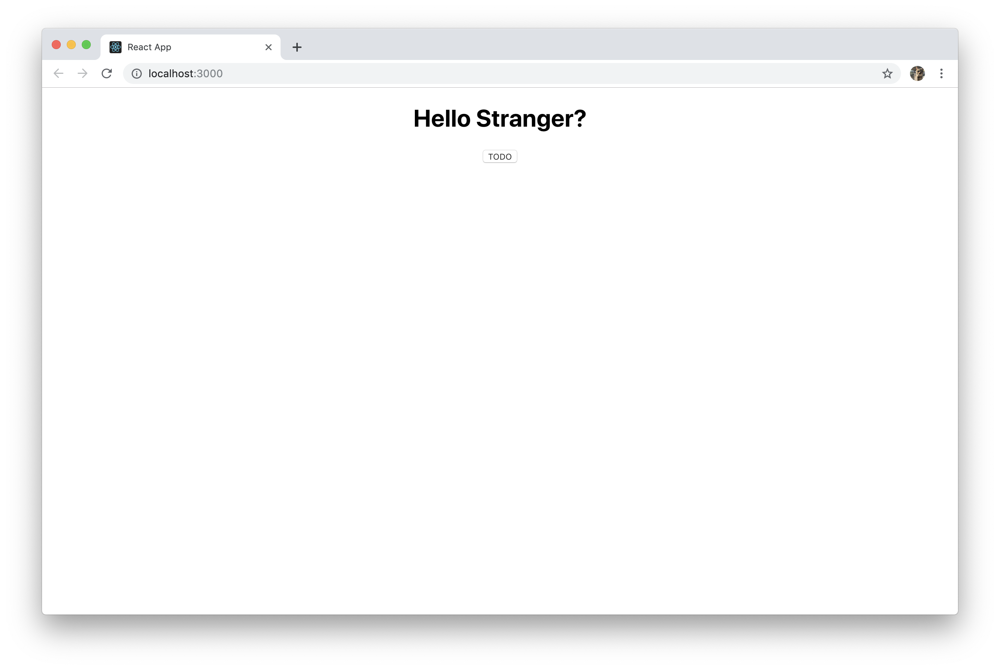

# React + Express Part 2

이제 간단한 앱을 만들어봅시다.
<br>
<br>

## 0️⃣ 간단한 앱 구성하기

`TODO` 버튼을 클릭하면 오늘 해야할 일을 보여주는 아주 간단한 앱을 만들어봅시다.  `/todo` 요청을 날리면, 다음과 같은 응답이 오도록 만들어봅시다. 

<br>

**server.js**

```js
const express = require('express');
const cors = require("cors")
const PORT = process.env.HTTP_PORT || 4001;

const app = express();
app.use(cors())

const todoList = [
  {
    id: 0,
    title: 'Elastic Beanstalk',
    description: 'ElasticBeanstalk으로 배포하기'
  },
  {
    id: 1,
    title: 'CircleCI',
    description: 'CircleCI로 CI/CD 세팅하기'
  }
]

app.get('/todos', (req, res) => {
  res.json(todoList);
});

app.listen(PORT, () => {
  console.log(`Server listening at port ${PORT}.`);
})
```

<br>

`yarn start` 또는 `npm start`로 **server**를 실행시켜봅시다.

**localhost:4001/todos**

응답이 잘 오는 것을 확인할 수 있습니다.

<br>

`TODO` 버튼을 클릭하면,  **title**과 **description** 옆에 할 일이 채워지도록 만들어봅시다.

``` bash
# 현재 경로: ~/amathon/client

$ yarn add axios
```
#### 🤙 Axios?

> [Axios](https://github.com/axios/axios)란 HTTP 클라이언트 라이브러리로써, 비동기 방식으로 HTTP 데이터 요청을 실행합니다.

<br>

**client/src/App.js**

```js
import React from 'react';
import './App.css';
import axios from 'axios';

class App extends React.Component {
  constructor(props) {
    super(props);
    this.state = {
      todoList: []
    }
  }
  getToDo = async () => {
    try {
      const response = await axios.get('/todos');
      console.log('response data: ', response.data)
      this.setState({
        todoList: response.data
      })
    } catch (error) {
      console.error(error);
    }
  }

  render() {
    console.log(this.state.todolist)
    const todos = this.state.todoList
    return (
      <div className="App">
        <h1>Hello Stranger?</h1>
        <button onClick={this.getToDo}>
          TODO
        </button>
        <div>
          {todos.map(todo => (
            <h3 key={todo.id}>
              제목: {todo.title}<br/>설명: {todo.description}
            </h3>
          ))}
        </div>
      </div>
    )
  }

}

export default App;
```

<br>

## 1️⃣ server와 client 통신하기

여기서 **client**는 3000번 포트에서 실행되고, **server**는 4001번 포트에서 실행되면, 그 둘은 어떻게 통신할 수 있을까요? `http-proxy-middleware` 패키지를 사용하면 됩니다.

<br>

#### 🤙 http-proxy-middleware? 

>CRA를 통해 React 프로젝트를 생성하면 자동으로 서버가 함께 생성됩니다. 하지만, 우리는 Express로 구축된 서버가 있기 때문에 2개의 서버가 존재합니다. 따라서, proxy 설정을 해줘야합니다. react-scripts의 버전이 2 이상인 경우 [http-proxy-middleware](https://github.com/chimurai/http-proxy-middleware)를 설치해 setupProxy.js 파일 생성을 통해 proxy 설정을 할 수 있습니다.

<br>

```bash
# 현재 경로: ~/amathon/client

$ yarn add http-proxy-middleware
또는
$ npm install --save-dev http-proxy-middleware
```

<br>

**client/src/setupProxy.js**

```js
const proxy = require('http-proxy-middleware')

module.exports = function (app) {
  app.use(proxy('/todos', { target: 'http://127.0.0.1:4001/' }));
};
```

<br>

이제, **서버**와 **클라이언트**가 통신할 수 있습니다. 두 개의 터미널을 열어 **server**와 **client**를 실행시켜 봅시다. 이미 서버가 작동하고 있더라도 setupProxy의 적용을 위해 서버를 재시작해야 합니다.

```bash
# client
$ cd client
$ yarn start
또는
$ npm start

# server
$ yarn start
또는
$ npm start
```


(왼쪽은 **server**, 오른쪽은 **client**입니다.)

<br>



**TODO** 버튼을 클릭하면 다음과 같이 현재 **state**에 저장된 값을 가져오는 것을 확인할 수 있습니다. 


<br>

## 2️⃣ script 한번에 작성하기

**server**와 **client** 매번 2개씩 열기 귀찮으니 한번에 열 수 있도록 **script**를 수정해봅시다. 
#### 🤙 npm-run-all?

>  npm의 여러 script를 동시에 실행시켜주는 package로 동시에 실행시켜야할 때 간편한 도구입니다. 

```bash
$ yarn add --dev npm-run-all
또는
$ npm install npm-run-all --save-dev
```

<br>

```json
// package.json
"scripts": {
	"start": "npm-run-all --parallel start:**",
	"start:server": "nodemon --exec babel-node server.js --ignore client/",
	"start:client": "cd ./client && yarn start"
},
```

<br>

`yarn start` 혹은 `npm start` script를 통해 **server**와 **client**가 동시에 실행되는 것을 확인할 수 있습니다.

<br>

## 3️⃣ React App 빌드하기


**client** 폴더 하위에 `.gitignore` 파일을 수정해주세요. `build` 폴더를 **elastic beanstalk**을 통해 업로드해야하므로  ignore하지 않도록 지워주세요.

**client/.gitignore**
```
# production
# /build
```

<br>

```shell
# 프로젝트의 root 경로로 이동해주세요.
$ cd client
$ yarn build
또는
$ npm build
```

<br>

`server.js` 코드에 build된 **static file**을 **serve**하도록 코드를 추가해줍시다.

**server.js**

```javascript
const path = require('path');
const express = require('express');
const cors = require("cors")
const PORT = process.env.HTTP_PORT || 4001;

const app = express();
app.use(cors())

const todoList = [
  {
    id: 0,
    title: 'Elastic Beanstalk',
    description: 'ElasticBeanstalk으로 배포하기'
  },
  {
    id: 1,
    title: 'CircleCI',
    description: 'CircleCI로 CI/CD 세팅하기'
  }
]

app.use(express.static(path.join(__dirname, 'client', 'build')));

app.get('/todos', (req, res) => {
  res.json(todoList);
});

app.listen(PORT, () => {
  console.log(`Server listening at port ${PORT}.`);
})
```


이제 **client**를 실행할 필요없이, **server**만 실행해보도록 합시다.`yarn start:server` 혹은 `npm start:server` script를 사용해 실행시켜봅시다.

**localhost:4001**


**4001번** 포트로 접속해보면, **build**된 React Application을 확인할 수 있습니다. 


이제 **Elastic Beanstalk**으로 배포해보도록 합시다. [다음 가이드로 이동하기](./ElasticBeanstalk.md)
